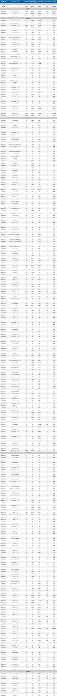

<h1 align="center">Datasets</h1>
<p align="center">
The currently supported datasets are - <a href="http://host.robots.ox.ac.uk/pascal/VOC/">Pascal VOC</a>, <a href="http://cocodataset.org/">MS-COCO</a>, <a href="http://image-net.org/challenges/LSVRC/2017/download-images-1p39.php">ImageNet-DET</a> and <a href="http://image-net.org/challenges/LSVRC/2017/download-images-1p39.php">ImageNet-VID</a>
</p>

<p align="center">The datasets will be stored in the following directory structure</p>
<pre>
VidDet/
└── datasets/
    ├── ImageNetDET (170.8 GB)
    ├── ImageNetVID (409.9 GB)
    ├── MSCoco (84.9 GB)
    ├── PascalVOC (9.8 GB)
    └── # version controlled files
</pre>

<p align="center">The datasets can be downloaded with their associated <code>.sh</code> script</p>

``` bash
VidDet/datasets$ . get_voc_dataset.sh
VidDet/datasets$ . get_coco_dataset.sh
VidDet/datasets$ . get_imgnetdet_dataset.sh
VidDet/datasets$ . get_imgnetvid_dataset.sh
```

<p align="center">These will make new directories (as shown in the structure above) and download into. If you want to use <b>symbolically linked</b> directories you will need to make these prior to running the scripts

<p align="center">.......</p>
<p align="center">If using the <a href="http://image-net.org/challenges/LSVRC/2017/download-images-1p39.php">ImageNet-VID</a> dataset please also download the <a href="https://drive.google.com/open?id=1-bvtqx71KNfNSi7twXbgBDdeoCA_use7"><code>val_motion_ious.json</code></a> file from my <a href="https://drive.google.com/open?id=1-bvtqx71KNfNSi7twXbgBDdeoCA_use7">Google Drive</a> and place it in the <code>VidDet/datasets/ImageNetVID/ILSVRC/</code> directory. This file allows for motion based evaluation, it will be generated when needed by <a href="https://github.com/HaydenFaulkner/VidDet/blob/ba28d3bf082c9e74a769bd2f1d7df47626e46b23/datasets/imgnetvid.py#L740"><code>generate_motion_ious()</code></a> in <a href="imgnetvid.py"><code>imgnetvid.py</code></a> if non existent however this is relatively time consuming, so we suggest downloading.</p>


<h2 align="center"></h2>
<h2 align="center">A Combined Dataset</h2>
<p align="center">It's possible to combine all four datasets into one larger dataset with the utilisation of the <a href="https://github.com/HaydenFaulkner/VidDet/blob/ba28d3bf082c9e74a769bd2f1d7df47626e46b23/datasets/combined.py#L16"><code>CombinedDetection()</code></a> dataset specified in <a href="combined.py"><code>combined.py</code></a></p>

<p align="center">Following ideas from <a href="https://github.com/philipperemy/yolo-9000">YOLO-9k</a> with utilising the <a href="https://wordnet.princeton.edu/">WordNet</a> structure classes have been manually matched across datasets, furthermore a <b>hierarchical tree structure</b> has been generated for the classes. This is visualised below and is specified in <a href="trees"><code>trees/</code></a>, with the main tree (inclusive of <a href="http://image-net.org/challenges/LSVRC/2017/download-images-1p39.php">ImageNet-DET</a>) specified in <a href="trees/filtered.tree"><code>trees/filtered.tree</code></a></p>

<p align="center"></p>

<h2 align="center"></h2>
<h2 align="center">Stats</h2>

<p align="center"></p>
